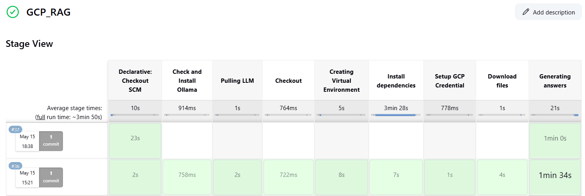

## This is only for my personal note

1. Create a Pub/Sub Topic:
   gcloud pubsub topics create TOPIC_NAME

2. Create notification:
   gsutil notification create -t my-topic -f json -e OBJECT_FINALIZE -p my-folder/ gs://my-bucket

3. Check notification:
   gsutil notification list gs://gcp-rag

4. Delete Notification:
   gcloud storage buckets notifications delete projects/\_/buckets/BUCKET_NAME/notificationConfigs/NOTIFICATION_ID

5. Create notification using GCP WEB UI, this is used in Jenkins
   https://d902-216-209-2-200.ngrok-free.app/generic-webhook-trigger/invoke?token=gcs_update_secret_123

6. Execute the Jenkins Job, it takes your question as input!

Example :

